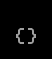

### AI Driven Migrations

#### Getting Started

Welcome to your AI migration platform for applications.

| Icon | Description |
|------|-------------|
|  | **Home** Select this option to return to the AI editor |
|  | **Future Use** Reserved for future AI functionality |
|  | **Future Use** Reserved for future AI functionality |
|  | **Program Stats** Generate a set of stats on programs in the repo related to extracted rules, non-rules, and data elements referenced by the code |
|  | **Future Use** Reserved for future AI functionality |
|  | **Future Use** Reserved for future AI functionality |
|  | **Future Use** Reserved for future AI functionality |
|  | **Future Use** Reserved for future AI functionality |
|  | **Parse** Identify and catalogue all the data elements referenced by the code components |
|  | **Future Use** Reserved for future AI functionality |
|  | **Future Use** Reserved for future AI functionality |
|  | **Future Use** Reserved for future AI functionality |
|  | **Future Use** Reserved for future AI functionality |
|  | **Select Repo** Identify the github repo for migrations |
|  | **Graph** Create a graph of the repo showing essential relationships between components|
|  | **Text Edit** Examine, edit, review and approve AI generated documents |
|  | **Expired** A fun little timer |
