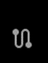

### AI Driven Migrations

#### Getting Started

Welcome to your AI migration platform for applications.

    
    Home

    Select this option to return to the AI editor
 

    
    Future Use

    Reserved for future AI functionality
 

    
    Future Use

    Reserved for future AI functionality
 

    
    Future Use

    Generate a set of stats on programs in the repo related to extracted rules, non-rules and data elements referenced by the code

 

    
    Future Use

    Reserved for future AI functionality
 